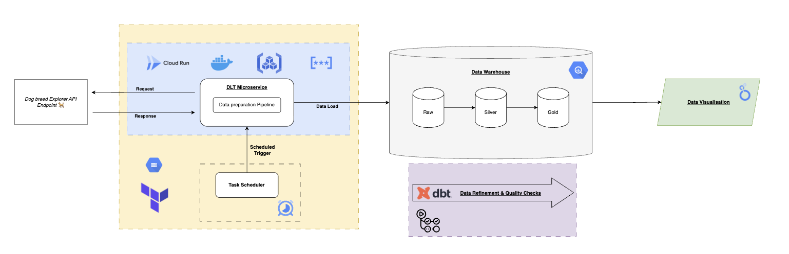

# Dog Breed Explorer

## Overview

This project implements a production-ready, serverless data platform on Google Cloud Platform that extracts dog breed data from TheDogAPI, loads it into BigQuery, and transforms it using dbt locally or inside CI/CD workflow.

## Looker Studio Results

View the end-to-end pipeline results in the interactive dashboard:

**[Dog Breed Explorer Dashboard](https://lookerstudio.google.com/reporting/bc8798ae-6ec9-4588-bd2c-ea5509fbf980)**

The dashboard visualizes the transformed data from the analytics layer, showcasing breed characteristics, temperament analysis, and other insights enabled by this analytics platfom.

## Technologies



- **Data Ingestion**: dlt (data load tool), Python 3.11
- **Data Warehouse**: Google BigQuery
- **Data Transformation**: dbt (data build tool)
- **Infrastructure**: Terraform, Google Cloud Platform
- **Compute**: Cloud Run Jobs, Cloud Scheduler
- **CI/CD**: GitHub Actions, Workload Identity Federation
- **Secrets**: Google Secret Manager
- **Containerization**: Docker, Artifact Registry

## Architecture

The architecture is organized into three core layers:

### Data Ingestion Layer
The dlt (data load tool) pipeline runs as a containerized Cloud Run Job, fetching dog breed data from TheDogAPI and loading it into BigQuery's raw dataset. The pipeline is scheduled weekly via Cloud Scheduler and authenticates using service accounts with Application Default Credentials. The container image is stored in Artifact Registry and uses multi-stage builds for optimized size and security.

### Data Storage Layer
BigQuery serves as the data warehouse, organized following the medallion architecture with three datasets: `dog_breeds_raw` (source data as JSON), `dog_breeds_staging` (cleaned and typed data), and `dog_breeds_marts` (business-ready analytics tables). Each dataset represents a progressive refinement of the data, enabling clear data lineage and separation of concerns.

### Data Transformation Layer
dbt models transform raw data through staging and into analytical marts. Models are written in SQL with Jinja templating, include comprehensive data quality tests, and generate documentation. The transformation layer runs in GitHub Actions CI/CD, executing dbt models after successful pipeline runs and on pull request validation.

### Infrastructure Layer
All infrastructure is defined as Terraform code with reusable modules for Secret Manager and Cloud Run Jobs. State is managed remotely in GCS with locking enabled. BigQuery datasets are managed through the BigQuery UI. The modular design allows horizontal scaling by duplicating the dlt-ingestion module for additional data sources.

### CI/CD Layer
GitHub Actions workflows automate the entire deployment process using Workload Identity Federation for secure, keyless authentication. On pull requests, the workflow builds container images, runs integration tests with isolated BigQuery datasets, and executes dbt models for validation. All credentials are retrieved from Secret Manager at runtime.

## Project Structure

```
dog-breed-explorer/
├── .github/
│   └── workflows/              # GitHub Actions CI/CD workflows
│       └── pr-validation.yml   # PR validation with image build, tests, and dbt
├── dbt/
│   ├── models/                 # dbt transformation models
│   │   ├── raw/                # Raw layer - source definitions
│   │   ├── silver/             # Staging layer - cleaned and typed data
│   │   └── gold/               # Marts layer - business analytics tables
│   ├── macros/                 # Reusable dbt macros
│   ├── tests/                  # Custom dbt tests
│   └── dbt_project.yml         # dbt project configuration
├── docs/
│   ├── CLOUD_RUN_DEPLOYMENT.md           # Cloud Run Job deployment guide
│   └── SECRETS_AND_AUTHENTICATION.md     # Secrets management and Workload Identity
├── infrastructure/
│   ├── modules/
│   │   ├── secret-manager/     # Secret Manager resources and IAM bindings
│   │   └── dlt-ingestion/      # Cloud Run Job and Scheduler resources
│   ├── main.tf                 # Root Terraform orchestration
│   ├── variables.tf            # Variable definitions
│   ├── backend.tf              # Remote state configuration (GCS)
│   └── README.md               # Infrastructure deployment guide
├── pipelines/
│   └── dlt-ingestion/
│       ├── src/
│       │   ├── pipeline.py     # Main pipeline orchestration
│       │   ├── config.py       # Configuration loader
│       │   └── sources/        # dlt source definitions
│       ├── tests/              # Integration tests
│       ├── Dockerfile          # Multi-stage container image
│       └── README.md           # Pipeline usage guide
├── scripts/
│   └── local-test-dlt.sh       # Local Docker testing script
├── .env.example                # Environment variables template
└── README.md                   # This file
```

## Terraform Deployment

### Prerequisites

- Terraform >= 1.0 installed
- Google Cloud SDK (`gcloud`) authenticated
- GCP project with billing enabled and APIs enabled
- Service account JSON key file in project root
- GCS bucket for Terraform state
- **Service account IAM roles and Workload Identity Provider configured through GCP UI** (see [Secrets and Authentication](docs/SECRETS_AND_AUTHENTICATION.md))

### Deployment Steps

1. **Configure Backend**

   Create GCS bucket for remote state:
   ```bash
   gsutil mb -p <project-id> -l europe-west1 gs://<project-id>-tf-state
   gsutil versioning set on gs://<project-id>-tf-state
   ```

2. **Configure Variables**

   Create `infrastructure/secrets.tfvars` from template:
   ```bash
   cd infrastructure
   cp secrets.tfvars.example secrets.tfvars
   ```

   Edit with your values (project ID, service account emails, container image).

3. **Build and Push Container Image**

   Before deploying, push the dlt pipeline image:
   ```bash
   cd pipelines/dlt-ingestion
   docker build -t europe-west1-docker.pkg.dev/<project-id>/docker-repo/dlt-dog-breeds-pipeline:latest .
   gcloud auth configure-docker europe-west1-docker.pkg.dev
   docker push europe-west1-docker.pkg.dev/<project-id>/docker-repo/dlt-dog-breeds-pipeline:latest
   ```

4. **Deploy Infrastructure**

   ```bash
   cd infrastructure
   terraform init
   terraform plan -var-file="secrets.tfvars"
   terraform apply -var-file="secrets.tfvars"
   ```

5. **Verify Deployment**

   ```bash
   # Check Cloud Run Job
   gcloud run jobs list --region=europe-west1

   # Check Cloud Scheduler
   gcloud scheduler jobs list --location=europe-west1

   # Check secrets
   gcloud secrets list
   ```

**See**: [Infrastructure README](infrastructure/README.md) for detailed deployment instructions.

## CI/CD Workflow

The GitHub Actions workflow (`.github/workflows/pr-validation.yml`) automates validation and testing on pull requests:

### Workflow Steps

1. **Authenticate to GCP** - Uses Workload Identity Federation to impersonate service account (no keys stored in GitHub)
2. **Retrieve Secrets** - Fetches service account key and API credentials from Secret Manager
3. **Build Container Image** - Builds dlt pipeline Docker image with PR-specific tag
4. **Push to Artifact Registry** - Stores image for testing and potential deployment
5. **Create PR Dataset** - Creates isolated BigQuery dataset for integration testing
6. **Run Integration Tests** - Executes dlt pipeline against test dataset
7. **Run dbt Models** - Transforms data and validates with dbt tests
8. **Cleanup** - Deletes PR-specific dataset and resources

**See**: [Secrets and Authentication](docs/SECRETS_AND_AUTHENTICATION.md) for Workload Identity setup.

## Documentation

### Component Documentation

- [Infrastructure Deployment](infrastructure/README.md) - Terraform configuration and deployment guide
- [DLT Pipeline](pipelines/dlt-ingestion/README.md) - Pipeline usage, testing, and Docker deployment
- [dbt Documentation](dbt/README.md) - Data transformation models and testing (if exists)

### Architecture Documentation

- [Cloud Run Deployment](docs/CLOUD_RUN_DEPLOYMENT.md) - Cloud Run Job architecture, authentication, and troubleshooting
- [Secrets and Authentication](docs/SECRETS_AND_AUTHENTICATION.md) - Secret Manager setup and Workload Identity Federation

### Quick Start Guides

1. **Local Development** - See [DLT Pipeline README](pipelines/dlt-ingestion/README.md#setup)
2. **Infrastructure Deployment** - See [Infrastructure README](infrastructure/README.md#deployment)
3. **CI/CD Setup** - See [Secrets and Authentication](docs/SECRETS_AND_AUTHENTICATION.md#github-actions-authentication-workload-identity-federation)

## Getting Started

### Local Development

1. Clone the repository
2. Copy `.env.example` to `.env` and configure variables
3. Install Python dependencies: `pip install -r pipelines/dlt-ingestion/requirements.txt`
4. Run pipeline locally: `python pipelines/dlt-ingestion/src/pipeline.py`

### Testing

Run integration tests locally:
```bash
cd pipelines/dlt-ingestion
pytest tests/test_bigquery_integration.py -v
```

Test with Docker:
```bash
./scripts/local-test-dlt.sh
```

### Deployment

Deploy infrastructure to GCP:
```bash
cd infrastructure
terraform apply -var-file="secrets.tfvars"
```

Trigger Cloud Run Job manually:
```bash
gcloud run jobs execute dlt-dog-breeds-ingestion \
  --region=europe-west1 \
  --project=<project-id>
```

## Data Transformation with dbt

After the data ingestion pipeline has loaded raw data into BigQuery, use dbt to transform and refine the data through the medallion architecture layers (raw → silver → gold).

**See**: [dbt README](dbt/README.md) for complete instructions on running dbt models locally and understanding the transformation logic.

## Future Implementations

- **IAM Security Hardening** - Apply least-privilege principles to service account roles; currently service accounts use overly broad permissions
- **Service Account Separation** - Create dedicated service accounts for dlt pipeline and Terraform operations with scoped permissions
- **Image Build Optimization** - Implement Docker layer caching to reduce CI/CD build times
- **Artifact Registry Lifecycle Management** - Add automated cleanup policies to remove old or untagged container images
- **Environment Isolation** - Establish separate testing environment with dedicated datasets and infrastructure for production isolation
- **Multi-Environment dbt** - Parameterize dbt executions by target environment (dev, test, prod) for environment-specific transformations

